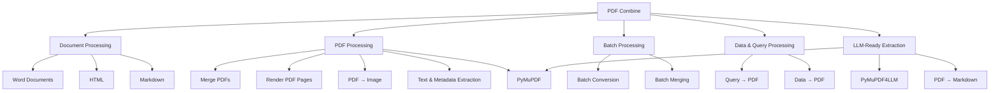
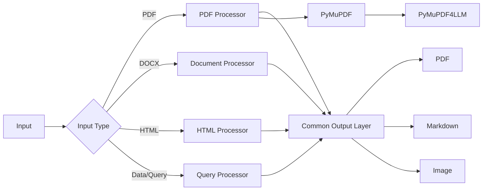
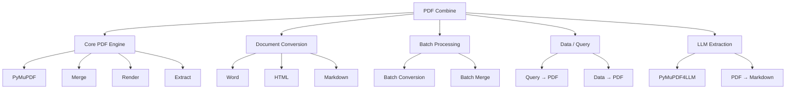

# PDF Combine — Consolidation & Implementation Plan

**Status:** Planned
**Primary Repository:** `PDF Combine`
**Document Type:** Implementation Plan
**Scope:** Repository consolidation, document-processing architecture, PDF rendering and LLM-ready extraction

---

## 1. Objective

Consolidate the existing document-processing projects into **PDF Combine**, establishing it as the single repository for document conversion, PDF manipulation, batch processing, and document extraction.

The current projects were developed as separate repositories:

* PDF Combine - 
* Word Document Merger - https://github.com/garcane/Word-Document-Merger
* Docs to Markdown - https://github.com/garcane/docx-to-md
* Batch to PDF - https://github.com/garcane/batch_to_pdf
* HTML to PDF - https://github.com/garcane/HTMLtoPDF
* PDF to Image - https://github.com/garcane/PDFtoImage
* Query to PDF - https://github.com/garcane/QueryPDF

Maintaining these as separate repositories creates unnecessary fragmentation. The functionality is closely related and can be maintained more effectively as a single application with a modular architecture.

The objective is therefore to:

1. Consolidate the existing functionality into PDF Combine.
2. Remove duplicated or fragmented implementations.
3. Establish a coherent document-processing architecture.
4. Use **PyMuPDF** as the primary PDF processing and rendering library.
5. Integrate **PyMuPDF4LLM** for LLM-oriented document extraction.
6. Preserve useful functionality from the existing repositories while allowing redundant implementations to be rewritten where appropriate.
7. Integrate the https://github.com/microsoft/markitdown where needed
7. Retire the standalone repositories once their functionality has been successfully migrated.
8. Present PDF Combine as a substantially more complete application on the GitHub profile.

This is primarily an **architectural consolidation**, rather than an attempt to significantly expand the application's scope.

---

# 2. Current Repository Landscape

The existing repositories represent individual components of a broader document-processing workflow.

| Repository           | Existing Purpose               | Target Capability     |
| --------------------- | ------------------------------ | --------------------- |
| PDF Combine          | PDF combination and processing | Core PDF application  |
| Word Document Merger | Word document merging          | Document processing   |
| Docs to Markdown     | Document/content conversion    | Markdown extraction   |
| Batch to PDF         | Batch document conversion      | Batch processing      |
| HTML to PDF          | HTML document conversion       | HTML → PDF            |
| PDF to Image         | PDF page rendering             | PDF rendering         |
| Query to PDF         | Query/data output to PDF       | Data → PDF generation |

The repositories should not simply be copied wholesale into PDF Combine.

Each project should first be reviewed to determine:

* Which functionality is still required.
* Which implementation is reusable.
* Which implementation should be rewritten.
* Which dependencies can be removed.
* Which functionality overlaps with another repository.
* Which functionality should become a shared internal module.

---

# 3. Target Architecture

PDF Combine should evolve from a narrowly focused PDF-merging application into a **modular document-processing application**.

The conceptual architecture is:



The architecture should favour **shared processing components** rather than separate implementations for every feature.

For example, PDF → Image should use the same PDF abstraction and rendering engine used elsewhere in the application rather than retaining an isolated implementation from the original repository.

---

# 4. Core Technology: PyMuPDF

**PyMuPDF** should become the primary PDF-processing library within PDF Combine.

Its role should include, where appropriate:

* Opening PDFs.
* Reading PDF metadata.
* Extracting text.
* Rendering PDF pages.
* Converting pages to images.
* Accessing PDF pages and objects.
* Page manipulation.
* PDF assembly and manipulation.
* Supporting downstream document-processing workflows.

This provides a common technical foundation for functionality currently distributed across several repositories.

### Principle

> PDF Combine should have one primary PDF processing layer rather than multiple independent PDF implementations.

Where existing repositories already provide equivalent functionality, the existing implementation should be evaluated against PyMuPDF before being retained.

---

# 5. PyMuPDF4LLM Integration

**PyMuPDF4LLM** should be incorporated as an additional extraction capability.

Its purpose is not to turn PDF Combine into an AI application. Instead, it provides a useful interface for preparing document content for downstream LLM workflows.

Potential functionality includes:

* PDF → Markdown.
* Structured document extraction.
* LLM-friendly text extraction.
* Extraction of document structure where supported.
* Preparation of PDFs for retrieval or analysis workflows.

The relationship should therefore be:

```text
PDF Combine
│
├── PyMuPDF
│   └── Core PDF processing
│
└── PyMuPDF4LLM
    └── LLM-oriented document extraction
```

PyMuPDF4LLM should not replace PyMuPDF.

It should sit above the underlying PDF-processing layer as a specialised capability.

---

# 6. Proposed Python Package Structure

The final structure should be determined after reviewing the existing repositories, but the target architecture should broadly follow:

```text
PDF-Combine/
│
├── README.md
├── LICENSE
├── pyproject.toml
├── .gitignore
│
├── docs/
│   └── PDF_COMBINE_CONSOLIDATION_PLAN.md
│
├── src/
│   └── pdf_combine/
│       │
│       ├── __init__.py
│       ├── cli.py
│       │
│       ├── pdf/
│       │   ├── __init__.py
│       │   ├── combine.py
│       │   ├── render.py
│       │   ├── extract.py
│       │   └── metadata.py
│       │
│       ├── documents/
│       │   ├── __init__.py
│       │   ├── word.py
│       │   ├── html.py
│       │   └── markdown.py
│       │
│       ├── batch/
│       │   ├── __init__.py
│       │   └── processor.py
│       │
│       ├── query/
│       │   ├── __init__.py
│       │   └── to_pdf.py
│       │
│       └── llm/
│           ├── __init__.py
│           └── extraction.py
│
└── tests/
    ├── test_combine.py
    ├── test_render.py
    ├── test_documents.py
    ├── test_batch.py
    ├── test_query.py
    └── test_llm.py
```

This is a **target structure**, not a requirement to reproduce it exactly.

The existing codebase should be inspected before restructuring so that useful implementations and history are not discarded unnecessarily.

---

# 7. Feature Migration Matrix

## 7.1 PDF Combine

### Source

`PDF Combine`

### Destination

Core PDF functionality.

### Action

**Retain and evolve.**

The existing PDF Combine implementation should become the foundation of the consolidated application.

Responsibilities should ultimately include:

* PDF combination.
* PDF manipulation.
* Shared PDF handling.
* Integration with PyMuPDF.

---

## 7.2 Word Document Merger

### Source

`Word Document Merger`

### Destination

`documents/word.py`

### Action

**Migrate and refactor.**

The existing implementation should be reviewed and adapted to the consolidated application's interfaces.

The functionality should become a document-processing capability rather than a standalone application.

---

## 7.3 Docs to Markdown

### Source

`Docs to Markdown`

### Destination

`documents/markdown.py` and/or `llm/extraction.py`

### Action

**Migrate and consolidate.**

The existing functionality should be compared with PyMuPDF4LLM.

Where PyMuPDF4LLM provides equivalent or superior PDF-to-Markdown functionality, duplicated implementation should be removed.

The application should retain a clear distinction between:

* General document conversion.
* LLM-oriented PDF extraction.

---

## 7.4 Batch to PDF

### Source

`Batch to PDF`

### Destination

`batch/processor.py`

### Action

**Migrate and generalise.**

Batch processing should become a reusable component capable of processing multiple files using the document-processing capabilities exposed by the application.

Potential operations include:

```text
Input directory
      │
      ▼
File discovery
      │
      ▼
File classification
      │
      ▼
Document processor
      │
      ▼
PDF generation
      │
      ▼
Output directory
```

---

## 7.5 HTML to PDF

### Source

`HTML to PDF`

### Destination

`documents/html.py`

### Action

**Migrate and refactor.**

The existing HTML-to-PDF functionality should be incorporated into the common document-processing architecture.

The implementation should be evaluated for:

* Rendering reliability.
* External dependencies.
* CSS support.
* Images and assets.
* Error handling.
* Cross-platform behaviour.

---

## 7.6 PDF to Image

### Source

`PDF to Image`

### Destination

`pdf/render.py`

### Action

**Migrate/reimplement using PyMuPDF.**

This is one of the clearest candidates for consolidation.

Rather than maintaining an independent PDF rendering implementation, PDF pages should be rendered through PyMuPDF.

Conceptually:

```text
PDF
 │
 ▼
PyMuPDF
 │
 ├── Page 1 → Image
 ├── Page 2 → Image
 ├── Page 3 → Image
 └── ...
```

This should provide the common rendering layer for any future functionality that requires page-level visual output.

---

## 7.7 Query to PDF

### Source

`Query to PDF`

### Destination

`query/to_pdf.py`

### Action

**Migrate and integrate.**

The existing query-to-PDF functionality should become part of the data/document generation layer.

The implementation should be reviewed to determine:

* Supported query sources.
* Input/output interfaces.
* Formatting requirements.
* Whether query execution and PDF generation should remain separate concerns.

The preferred architecture is:

```text
Query
  │
  ▼
Data
  │
  ▼
Document representation
  │
  ▼
PDF renderer
  │
  ▼
PDF
```

This avoids tightly coupling data retrieval to PDF generation.

---

# 8. Unified Processing Model

The consolidated application should expose common interfaces wherever possible.

A conceptual processing model is:



This architecture makes it easier to add future formats without creating another standalone repository.

---

# 9. Repository Consolidation Strategy

The repositories should be consolidated in controlled stages.

### Step 1 — Inventory

Review every existing repository.

Record:

* Entry points.
* Source files.
* Dependencies.
* CLI/UI components.
* Configuration.
* Tests.
* Documentation.
* Assets.
* Known limitations.
* Duplicated functionality.

### Step 2 — Classify

Each component should be assigned one of four outcomes:

| Classification | Meaning                                                  |
| --------------- | ---------------------------------------------------------- |
| Retain         | Existing code remains substantially useful               |
| Migrate        | Code moves into PDF Combine                              |
| Rewrite        | Functionality is retained but implementation is replaced |
| Remove         | Functionality is redundant or obsolete                   |

### Step 3 — Establish the target architecture

Create the core PDF Combine modules before moving every implementation across.

### Step 4 — Migrate functionality incrementally

Move one capability at a time and test it before proceeding.

### Step 5 — Consolidate dependencies

Remove dependencies that were only required by standalone implementations.

Where PyMuPDF can replace a separate PDF-processing dependency, evaluate whether the redundant dependency can be removed.

### Step 6 — Update documentation

The README should describe PDF Combine as the consolidated application rather than as simply a PDF merger.

### Step 7 — Retire standalone repositories

Once functionality has been migrated and validated, the original repositories can be archived or otherwise retired.

---

# 10. Dependency Strategy

The consolidation should actively reduce unnecessary dependencies.

The target dependency model should distinguish between:

### Core dependencies

Required for fundamental PDF Combine functionality.

```text
PyMuPDF
```

### Feature dependencies

Only required when a particular feature is used.

Examples may include:

```text
PyMuPDF4LLM
Word/document processing libraries
HTML rendering dependencies
Data/query libraries
```

The final dependency list should be determined after auditing the existing repositories.

The objective is to avoid making every feature a mandatory dependency when it is not required.

---

# 11. Testing Strategy

Every migrated capability should have regression coverage before its original repository is retired.

### Core PDF tests

* Merge multiple PDFs.
* Merge a single PDF.
* Handle empty input.
* Handle invalid PDFs.
* Preserve page order.
* Preserve expected document properties.

### Rendering tests

* Render individual pages.
* Render multiple pages.
* Verify image output.
* Test different page sizes.
* Test different resolutions where supported.

### Document conversion tests

* DOCX → PDF.
* HTML → PDF.
* Markdown/document → expected output.
* Invalid document handling.

### Batch tests

* Multiple input files.
* Mixed supported formats.
* Empty directories.
* Invalid files.
* Partial failures.
* Output naming.

### Query tests

* Valid query/data input.
* Empty result sets.
* Formatting.
* PDF generation.
* Error handling.

### LLM extraction tests

* PDF → Markdown.
* Text extraction.
* Multi-page documents.
* Structured documents.
* Documents containing images/tables where supported.

---

# 12. Error Handling

The consolidated application should establish consistent error handling rather than inheriting unrelated error-handling approaches from each repository.

Errors should provide:

1. The operation that failed.
2. The relevant input.
3. A useful explanation.
4. Where appropriate, a suggested resolution.

For batch operations, one invalid input should not necessarily terminate the entire batch.

Conceptually:

```text
Batch
 │
 ├── file_001.pdf → ✓
 ├── file_002.docx → ✓
 ├── file_003.html → ✗
 ├── file_004.pdf → ✓
 └── file_005.docx → ✓
 
Result
 ├── Successful: 4
 └── Failed: 1
```

---

# 13. Documentation Changes

The existing README should be rewritten around the consolidated application.

It should clearly communicate:

### What PDF Combine is

A modular document-processing application for combining, converting, rendering and extracting content from documents.

### Core capabilities

* PDF combination.
* Document conversion.
* HTML → PDF.
* Word/document processing.
* Batch processing.
* PDF → Image.
* Query/data → PDF.
* PDF → Markdown.
* LLM-ready document extraction.

### Technology

The README should explicitly document the role of:

* Python.
* PyMuPDF.
* PyMuPDF4LLM.
* Other feature-specific dependencies.

### Architecture

Include a simplified Mermaid diagram demonstrating how the components interact.

---

# 14. Git History and Repository Preservation

The consolidation should avoid unnecessarily destroying useful development history.

Before moving code, determine whether the original repositories contain:

* Significant development history.
* Useful commit messages.
* Issue discussions.
* Documentation.
* Demonstrations.
* Screenshots or examples.
* Releases.

Where practical, preserve relevant history through appropriate Git migration techniques.

The objective is not merely to produce a clean directory structure; it is to consolidate the projects while retaining useful provenance.

---

# 15. Standalone Repository Retirement

A standalone repository should only be retired after:

* Its functionality exists in PDF Combine.
* The migrated functionality has been tested.
* Documentation has been updated.
* Dependencies have been consolidated.
* No important assets or code remain exclusively in the original repository.
* The PDF Combine implementation is confirmed to work independently.

The original repositories can then be archived rather than immediately deleted where historical preservation is useful.

This keeps the GitHub profile cleaner without unnecessarily destroying project history.

---

# 16. Implementation Phases

## Phase 1 — Repository Audit

**Goal:** Understand the existing projects.

### Tasks

* [ ] Inspect PDF Combine.
* [ ] Inspect Word Document Merger.
* [ ] Inspect Docs to Markdown.
* [ ] Inspect Batch to PDF.
* [ ] Inspect HTML to PDF.
* [ ] Inspect PDF to Image.
* [ ] Inspect Query to PDF.
* [ ] Record dependencies.
* [ ] Identify duplicate functionality.
* [ ] Identify reusable components.
* [ ] Identify obsolete components.

### Deliverable

Repository migration matrix and dependency inventory.

---

## Phase 2 — Core Architecture

**Goal:** Establish PDF Combine as the target application.

### Tasks

* [ ] Define package structure.
* [ ] Establish PDF processing abstraction.
* [ ] Integrate PyMuPDF.
* [ ] Establish common error handling.
* [ ] Establish common configuration.
* [ ] Establish testing structure.
* [ ] Define feature interfaces.

### Deliverable

A functioning PDF Combine core with PyMuPDF integration.

---

## Phase 3 — PDF Functionality

**Goal:** Consolidate PDF-specific functionality.

### Tasks

* [ ] Consolidate PDF merging.
* [ ] Migrate PDF → Image.
* [ ] Implement PyMuPDF-based rendering.
* [ ] Consolidate text extraction.
* [ ] Consolidate metadata handling.
* [ ] Add regression tests.

### Deliverable

A unified PDF-processing layer.

---

## Phase 4 — Document Processing

**Goal:** Migrate document conversion capabilities.

### Tasks

* [ ] Migrate Word Document Merger.
* [ ] Migrate HTML → PDF.
* [ ] Migrate Docs → Markdown.
* [ ] Refactor shared interfaces.
* [ ] Remove redundant implementations.
* [ ] Add tests.

### Deliverable

Unified document-processing functionality.

---

## Phase 5 — Batch and Data Processing

**Goal:** Consolidate batch and query functionality.

### Tasks

* [ ] Migrate Batch to PDF.
* [ ] Generalise batch processing.
* [ ] Migrate Query to PDF.
* [ ] Separate data processing from PDF rendering.
* [ ] Add tests.

### Deliverable

Reusable batch and data-processing components.

---

## Phase 6 — LLM Extraction

**Goal:** Introduce LLM-ready document extraction.

### Tasks

* [ ] Integrate PyMuPDF4LLM.
* [ ] Implement PDF → Markdown.
* [ ] Evaluate structured document extraction.
* [ ] Test tables/images where applicable.
* [ ] Document LLM extraction functionality.

### Deliverable

Optional LLM-oriented document extraction capability.

---

## Phase 7 — Documentation and Release

**Goal:** Present the consolidated project as a finished application.

### Tasks

* [ ] Rewrite README.
* [ ] Add architecture diagram.
* [ ] Document installation.
* [ ] Document supported formats.
* [ ] Document CLI/UI usage.
* [ ] Document PyMuPDF integration.
* [ ] Document PyMuPDF4LLM integration.
* [ ] Add examples.
* [ ] Review project metadata.
* [ ] Review licence.
* [ ] Review dependency configuration.

### Deliverable

A coherent, publicly presentable PDF Combine repository.

---

## Phase 8 — Repository Retirement

**Goal:** Remove unnecessary repository fragmentation.

### Tasks

* [ ] Confirm all functionality has migrated.
* [ ] Confirm tests pass.
* [ ] Confirm documentation is complete.
* [ ] Preserve useful Git history.
* [ ] Archive standalone repositories.
* [ ] Remove obsolete repositories from the primary GitHub profile where appropriate.
* [ ] Update GitHub profile/project descriptions.

### Deliverable

PDF Combine becomes the single maintained repository for the document-processing application.

---

# 17. Target End State

The desired end state is:



The seven separate repositories become conceptually one application:

```text
PDF Combine
│
├── PDF Processing
├── Document Conversion
├── Batch Processing
├── Data → PDF
├── PDF → Image
├── PDF → Markdown
└── LLM-Ready Extraction
```

---

# 18. Success Criteria

The consolidation is considered successful when:

* [ ] PDF Combine contains the required functionality from all relevant source repositories.
* [ ] PDF processing is consolidated around PyMuPDF where appropriate.
* [ ] PyMuPDF4LLM provides the LLM-oriented extraction layer.
* [ ] Duplicate implementations have been removed.
* [ ] Dependencies have been rationalised.
* [ ] Core functionality has regression tests.
* [ ] Batch processing operates through the consolidated architecture.
* [ ] Document conversion operates through shared interfaces.
* [ ] Query/data processing is separated from PDF rendering where appropriate.
* [ ] README documentation describes the complete application.
* [ ] Mermaid architecture documentation is included.
* [ ] The original repositories have been safely archived or retired.
* [ ] PDF Combine can be understood as a single coherent project rather than a collection of unrelated utilities.

---

# 19. Design Principle

The central principle of this consolidation is:

> **Consolidate related capabilities, not merely repositories.**

PDF Combine should not become a directory containing several old projects.

It should become a single application whose architecture naturally accommodates the functionality that previously existed across those repositories.

The result should be easier to maintain, easier to understand, easier to demonstrate, and more representative of the overall scope of the work.
</content>
